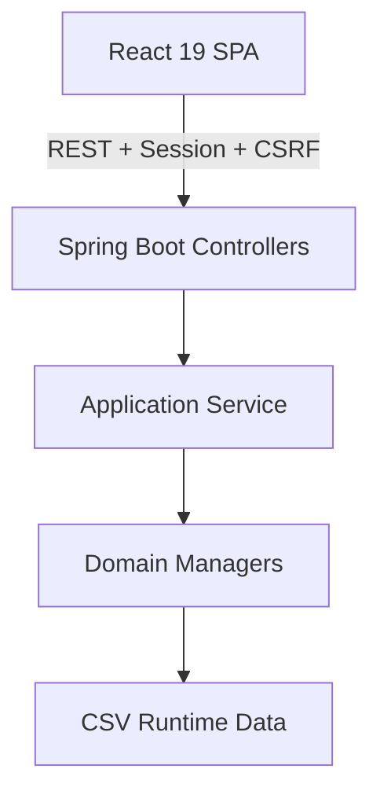
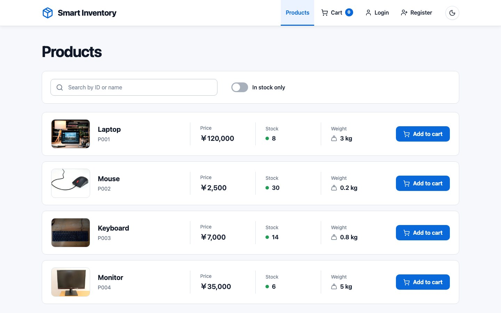
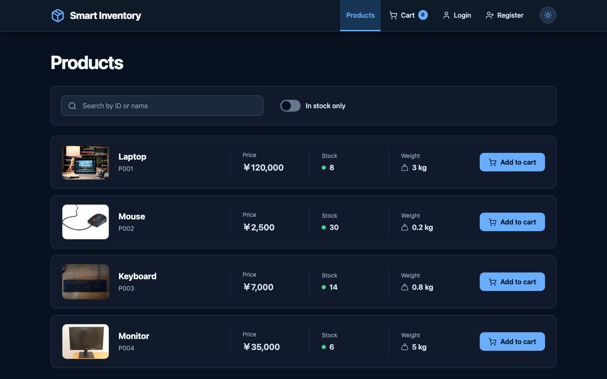
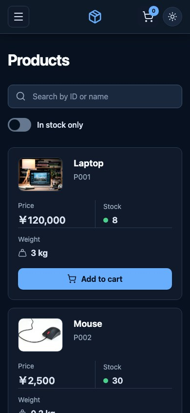
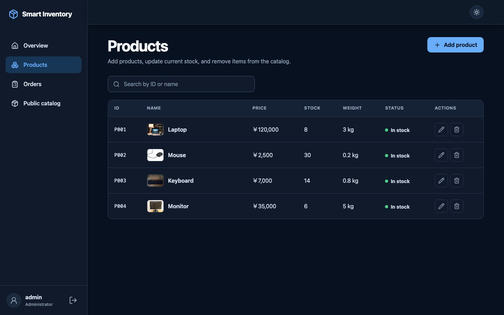
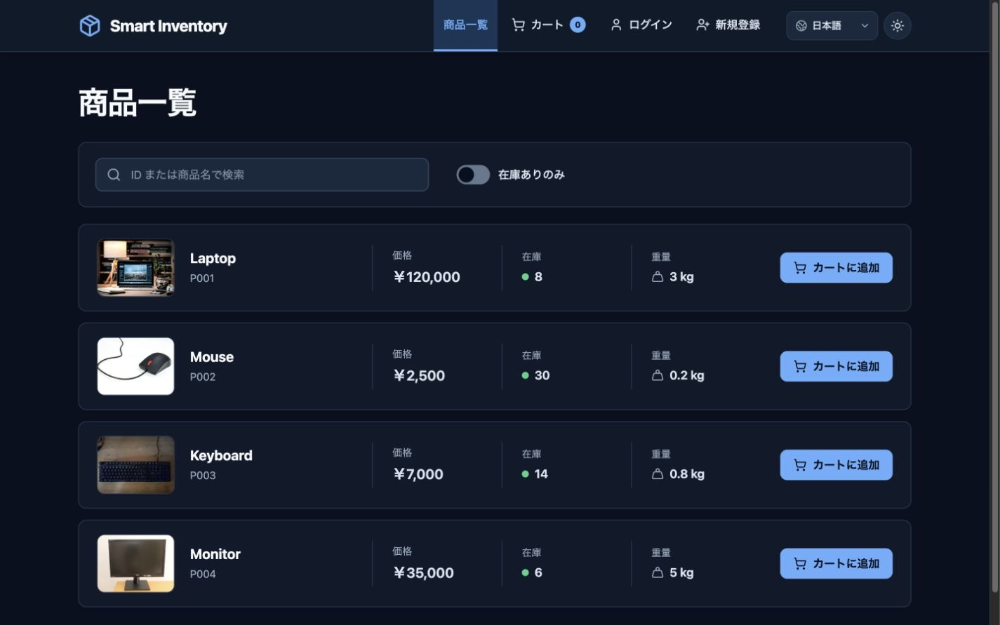
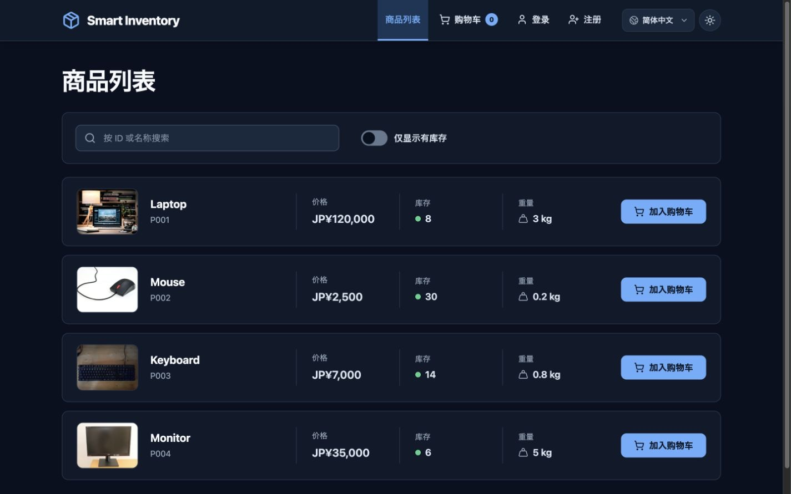
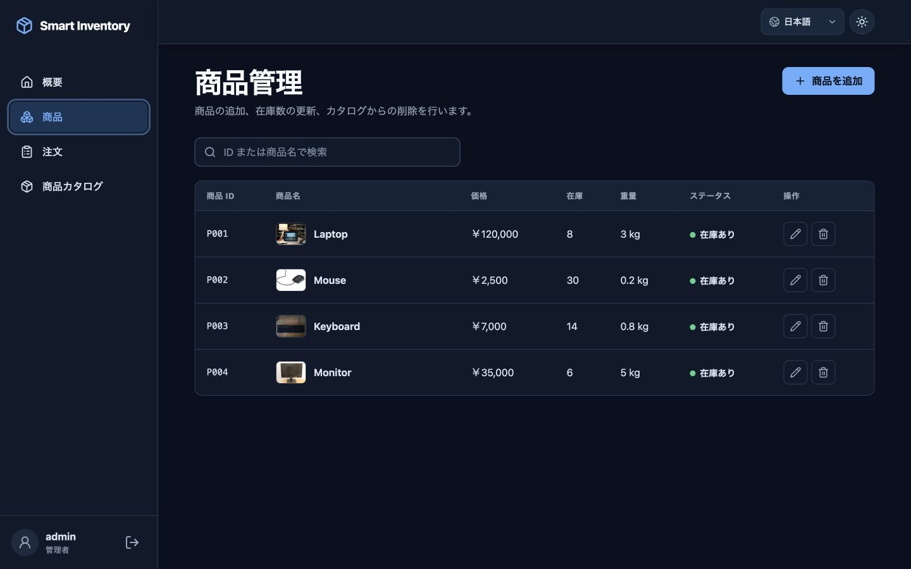
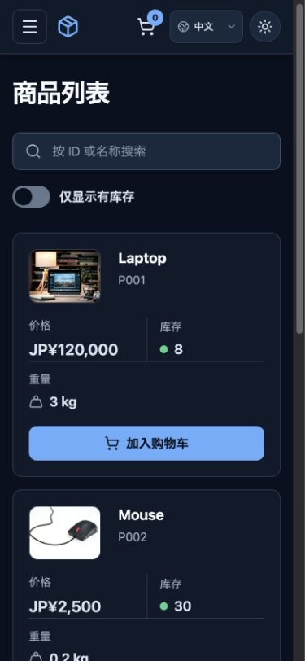

# Smart Inventory

Smart Inventory is a classroom and portfolio full-stack demo for managing products, stock, customer orders, and packing estimates. It combines a Spring Boot REST API with a React single-page application while preserving the business rules from the original Java object-oriented programming project.

The application runs in two modes:

- **Development:** Vite on `http://localhost:5173` proxies `/api` requests to Spring Boot on `http://localhost:8080`.
- **Production demo:** the React build is packaged inside one executable Spring Boot JAR and served from `http://localhost:8080`.

## From console project to full-stack application

The first version was a Java console application created for an Object-Oriented Programming course. Its source code, CSV data, documentation, and regression test remain unchanged under [`legacy-console/`](legacy-console/README.md) as a historical version. The web version moves the domain rules into a packaged Java 21 backend, adds concurrency-safe application services and a REST API, and provides a responsive React interface.

The console and web versions do not share runtime data.

## Features

- Public, case-insensitive product search by partial product ID or name
- Customer registration and session-based login
- Role-aware navigation and authorization for `CUSTOMER` and `ADMIN`
- Customer cart, order creation, order history, yen totals, weight totals, and 10 kg box estimates
- Atomic stock validation: repeated cart lines are merged and an insufficient item rejects the whole order without changing stock
- Admin dashboard, product creation, stock updates, product deletion, and order review
- Historical order-item snapshots that remain readable after a product changes or is deleted
- Accessible light and dark themes that follow the operating-system preference on first visit and persist the user's explicit choice
- Complete English, Japanese, and Simplified Chinese interfaces with automatic language detection and a persistent right-side language selector
- Locally served, optimized product photography with reusable loading and fallback behavior across the catalog, cart, orders, and admin views
- UTF-8 CSV persistence with seed data, legacy-format migration, fail-fast loading, rollback on save failure, and lock-protected access
- Consistent JSON errors for validation, authentication, authorization, domain, and persistence failures
- Backend, frontend unit, and browser end-to-end test suites
- A production build containing the frontend and backend in one executable JAR
- A Sites-compatible deployment that preserves the same UI and API contract with D1 persistence

## Architecture



Controllers translate HTTP requests and DTOs. `SmartInventoryService` owns the shared application state and read/write lock, coordinates domain managers, and handles persistence boundaries. Domain objects perform inventory, pricing, order, snapshot, and packing calculations. `CsvFileManager` loads and stores data without exposing CSV concerns through the API.

## Technology stack

| Layer | Technology |
| --- | --- |
| Backend | Java 21, Spring Boot 3.5.16, Spring MVC, Spring Security, Jakarta Bean Validation, Maven Wrapper |
| Backend tests | JUnit 5, MockMvc, Spring Security Test |
| Frontend | React 19, TypeScript strict mode, Vite, React Router, TanStack Query v5, i18next |
| Forms and HTTP | React Hook Form, Zod, Axios |
| UI | CSS Modules, Lucide React |
| Frontend tests | Vitest, React Testing Library, Playwright |
| Persistence | UTF-8 CSV files on local disk |
| Automation | Bash scripts and GitHub Actions |

## Repository structure

```text
.
├── backend/                 Spring Boot API, domain, persistence, and tests
├── frontend/                React/Vite SPA, unit tests, and Playwright tests
├── site/                    Sites/Vinext deployment with D1-backed API
├── legacy-console/          Original OOP course console application
├── runtime-data/            Local web-app CSV data; generated and ignored by Git
├── scripts/                 Development, test, build, and data-reset commands
├── .github/workflows/       Continuous integration
├── docs/design-reference/   Design concepts, not runtime screenshots
├── docs/screenshots/        Verified captures from the running production JAR
├── docs/THIRD_PARTY_ASSETS.md  Product-image sources, licenses, and transformations
├── README.md
└── LICENSE
```

## Requirements

- Java Development Kit 21
- Node.js 24 and npm
- Bash on macOS or Linux
- A Chromium-compatible Playwright browser for E2E tests

The Maven Wrapper downloads the required Maven distribution automatically. A global Maven installation is not required.

Confirm the main tool versions with:

```bash
java -version
node -v
npm -v
```

## Development quick start

From the repository root:

```bash
npm --prefix frontend ci
./scripts/dev.sh
```

Open [http://localhost:5173](http://localhost:5173). Press `Ctrl+C` once to stop both Vite and Spring Boot. The script resolves paths relative to the repository, so it also works when invoked from another directory.

The default development ports are:

| Process | URL |
| --- | --- |
| React/Vite | `http://localhost:5173` |
| Spring Boot API | `http://localhost:8080/api` |

Vite proxies only `/api` to Spring Boot. Frontend source code uses relative `/api` URLs rather than a hard-coded backend origin.

### Runtime configuration

| Setting | Configuration key | Default |
| --- | --- | --- |
| CSV data directory | `SMART_INVENTORY_DATA_DIR` | `./runtime-data` |
| CORS origins | `SMART_INVENTORY_ALLOWED_ORIGINS` | `http://localhost:5173` |
| Low-stock threshold | `app.low-stock-threshold` | `5` |
| Secure session cookie | `SMART_INVENTORY_SECURE_COOKIE` | `false` |

`scripts/dev.sh` points `SMART_INVENTORY_DATA_DIR` at the repository-level `runtime-data/` directory unless the variable is already set. For credentialed CORS, configure explicit origins; `*` is not accepted.

## Production build

Run the complete lint, test, frontend build, and backend package pipeline:

```bash
./scripts/build-demo.sh
```

The result is:

```text
backend/target/smart-inventory-demo.jar
```

Generated frontend files remain in build output and are not copied into `backend/src/main/resources/static` or committed to Git.

## Run the single JAR

Run this command from the repository root so the default data directory is `runtime-data/`:

```bash
java -jar backend/target/smart-inventory-demo.jar
```

Then open [http://localhost:8080/products](http://localhost:8080/products). Client-side routes such as `/cart`, `/orders`, `/admin`, and `/admin/products` are forwarded to `index.html` when refreshed. Unknown `/api/**` paths continue to return a JSON 404 rather than the React page.

To use an explicit data location:

```bash
SMART_INVENTORY_DATA_DIR=/absolute/path/to/data \
  java -jar backend/target/smart-inventory-demo.jar
```

For HTTPS deployment, set `SMART_INVENTORY_SECURE_COOKIE=true` so the session cookie receives the Secure attribute.

## Demo accounts

### Admin

```text
username: admin
password: admin123
```

### Customer

```text
username: customer
password: user123
```

These credentials are for local demonstration only. Seed passwords are stored as adaptive password hashes, not plaintext.

## Reset demo data

Stop the application, then run:

```bash
./scripts/reset-demo-data.sh
```

For safety, the script accepts no path argument and only removes the repository's non-symlink `runtime-data/` directory. On the next start, each missing CSV file is copied from the packaged seed data. Existing runtime files are never silently overwritten by seed files.

## Tests

### Complete backend and frontend check

```bash
./scripts/test.sh
```

This runs backend tests, installs the locked frontend dependencies, lints the frontend, runs frontend unit tests once, creates a production frontend build, checks shared UI parity, and scans for untranslated visible UI strings.

### Backend tests

```bash
(cd backend && ./mvnw test)
```

The JUnit and MockMvc suites cover preserved domain rules, CSV compatibility and failure behavior, authentication and CSRF, role authorization, API contracts, and application-service rollback behavior.

### Frontend tests

```bash
npm --prefix frontend ci
npm --prefix frontend run lint
npm --prefix frontend run test -- --run
npm --prefix frontend run build
```

Vitest and React Testing Library cover user-visible states and interactions. TypeScript is checked in strict mode during the production build.

### E2E tests

Install the Playwright browser once, then run the E2E suite:

```bash
(cd frontend && npm exec -- playwright install chromium)
npm --prefix frontend run test:e2e
```

The Playwright configuration starts the required application processes and uses isolated test data; it does not modify the developer's `runtime-data/` directory.

### Sites deployment checks

The hosted version uses the same React screens and REST contract, with a Cloudflare Worker-compatible API and D1 database in place of the local Spring Boot process and CSV files:

```bash
(cd site && npx --yes npm@11.6.2 ci)
npm --prefix site run test
npm --prefix site run lint
npm --prefix site run build
```

For a local Sites preview:

```bash
npm --prefix site run dev
```

Open [http://localhost:3000/products](http://localhost:3000/products). The hosted database is independent from both `runtime-data/` and `legacy-console/data/`.

## API overview

All endpoints use JSON under `/api`. Yen values are decimal strings in API messages so JavaScript never loses integer precision; the frontend converts them to `BigInt` for formatting and arithmetic.

| Method | Endpoint | Access | Purpose |
| --- | --- | --- | --- |
| `GET` | `/api/auth/csrf` | Public | Obtain the CSRF token and header name |
| `POST` | `/api/auth/register` | Public + CSRF | Register a `CUSTOMER` account |
| `POST` | `/api/auth/login` | Public + CSRF | Authenticate and create a session |
| `GET` | `/api/auth/me` | Authenticated | Read the current user and role |
| `POST` | `/api/auth/logout` | Authenticated + CSRF | Invalidate the current session |
| `GET` | `/api/products` | Public | List or search products; supports `q` and `inStockOnly` |
| `GET` | `/api/products/{id}` | Public | Read one product |
| `POST` | `/api/products` | Admin + CSRF | Create a product |
| `PATCH` | `/api/products/{id}/stock` | Admin + CSRF | Replace current stock quantity |
| `DELETE` | `/api/products/{id}` | Admin + CSRF | Delete a product without damaging order history |
| `POST` | `/api/orders` | Customer + CSRF | Create an order from current inventory |
| `GET` | `/api/orders/me` | Customer | Read the current customer's orders |
| `GET` | `/api/orders` | Admin | Read all orders or filter by customer |
| `GET` | `/api/admin/summary` | Admin | Read inventory and order dashboard totals |

Registration never accepts a role, and an order's customer name always comes from the authenticated session. Product names, prices, weights, totals, and packing estimates are calculated or loaded by the server rather than trusted from the cart request.

## CSV persistence design

Packaged seed files live in `backend/src/main/resources/seed-data/`. On first start, missing files are copied to `runtime-data/`; existing files are preserved. Loading is all-or-nothing: unreadable files, malformed rows, invalid values, or duplicate identifiers stop startup instead of producing partial state or overwriting user data.

The loader accepts the original console formats, including integer-valued prices written with `.0`, legacy order entries such as `P001:2`, and snapshot entries such as `P001:Laptop:120000:3.0:2`. Subsequent saves use the current snapshot format.

Concurrent reads use a read lock. Registration, inventory changes, and order creation use a write lock. The complete order operation—merging repeated items, validating all stock, creating snapshots, reducing stock, appending the order, and persisting both files—runs under one write lock. A persistence error restores the in-memory inventory and order state. Files are prepared as temporary files before target replacement, with backup restoration attempted if a multi-file replacement fails.

**CSV persistence is suitable for a classroom/portfolio demo. It is not a replacement for a transactional production database.**

## Password hashing and session security

- New passwords are encoded through Spring Security's delegating password encoder and stored with an algorithm prefix such as `{bcrypt}`.
- Compatible plaintext user rows from the original project are fully validated and atomically migrated to encoded values during startup; an invalid row stops startup without overwriting the file.
- Passwords and hashes are never returned by an API DTO or written to application logs.
- Authentication uses an `HttpOnly`, `SameSite=Lax` `JSESSIONID` cookie with a 30-minute session timeout rather than JWT.
- CSRF protection remains enabled for login, registration, logout, and every state-changing endpoint. The SPA obtains token metadata from `/api/auth/csrf` and sends the supplied header.
- Authentication failures use one generic response and do not reveal whether a username exists.
- The configured CORS allowlist supports credentials only for explicit origins.

## Known limitations

- CSV files are local, single-instance storage. External writers and horizontally scaled application instances are not supported.
- The backup-and-replace process reduces multi-file failure risk but is not equivalent to an ACID database transaction or durable write-ahead log.
- Large product and order collections are held in memory and API list endpoints are not paginated.
- Demo accounts use published passwords. The application has no password reset, email verification, multi-factor authentication, account lockout, or production-grade rate limiting.
- User administration, product image upload, payment, shipping integration, and real warehouse bin tracking are outside this demo's scope. The included demo products instead use bundled, ID-mapped images.
- Browser E2E tests target the configured local Chromium environment; broader browser and device coverage would be required for production release.

## Theme and product imagery

The interface supports light and dark modes throughout the public and admin experiences. On a first visit it follows the operating system's color-scheme preference; after the user changes the theme, that explicit choice is stored locally and restored on later visits. Motion is intentionally brief and respects the browser's reduced-motion preference.

Images for the seeded products are optimized WebP files served from the application itself, so the runtime does not depend on third-party image hotlinks. A shared image component provides consistent sizing, loading, and fallbacks wherever products appear. Original sources, licenses, download dates, and transformations are documented in [`docs/THIRD_PARTY_ASSETS.md`](docs/THIRD_PARTY_ASSETS.md).

## Internationalization

The complete public and admin interfaces support three languages:

- English (`en`, formatted with `en-US`)
- Japanese (`ja`, formatted with `ja-JP`)
- Simplified Chinese (`zh-CN`, formatted with `zh-CN`)

On the first visit, the application checks a valid saved preference, then `navigator.languages`, then `navigator.language`, and finally falls back to English. English regional tags map to English, Japanese tags map to Japanese, and all currently recognized Chinese tags—including `zh-TW`—map to the available Simplified Chinese interface. The native-language selector appears in the right-side action area beside the theme control on public and admin layouts, including mobile headers.

Language and theme are independent device-local preferences:

```text
smart-inventory-language:v1
smart-inventory-theme:v1
```

Changing language updates the current page immediately without reloading, changing the URL, signing the user out, clearing the cart, or resetting the theme. JPY amounts, numbers, stock quantities, and weights use the active locale. Interface text, validation messages, accessible labels, notifications, and known API errors are translated; business data is not. Product names, usernames, product IDs, order IDs, roles, and historical order snapshots therefore remain exactly as stored by the backend or D1 database.

## Screenshots

These captures were taken from the final executable JAR during an isolated browser QA run.

### Product catalog — light theme, desktop



### Product catalog — dark theme, desktop



### Product catalog — dark theme, mobile



### Admin products — dark theme, desktop



### Product catalog — Japanese, desktop



### Product catalog — Simplified Chinese, desktop



### Admin products — Japanese, desktop



### Product catalog — Simplified Chinese, mobile



Files under `docs/design-reference/` are early design concepts rather than captures of the running application.

## License

This project is available under the [MIT License](LICENSE).
